# Introduction

<u>High Level Description and Motivation</u>

Our high-level topic area is robot navigation and path planning. We are attempting to help robots navigate their surroundings better using a process called semantic segmentation. This project is important for helping robots improve their own capabilities, particularly in terms of autonomous navigation and decision-making. This project area could lead to safer and more efficient robot operations in various environments, benefitting industries like manufacturing, logistics, healthcare, and more. A successful implementation of advanced semantic segmentation algorithms tailored specifically for robot navigation would provide robots with enhanced situational awareness. This would lead to improved path planning, avoiding obstacles better, and overall navigation efficiency, which would ultimately contribute to increased autonomy, safety, and productivity in robot applications.


<u>Specific Problem Definition</u>

The problem we are trying to solve with our project is improving robot navigation through advanced semantic segmentation algorithms. Our goal was to enhance robot autonomy by providing detailed scene understanding. This would help with intelligent decision-making, as well as improving navigation efficiency and safety. The expected input for the semantic segmentation algorithms would be images (ideally captured by the robots’ sensors or camera systems), that depict the robots’ surroundings. These images are very similar to ones of any place that can be captured by a normal camera. These images can contain various objects, obstacles, and environmental features that need to be accurately identified and categorized. The expected output would be pixel-level segmentation maps with accurately labeled categories or classes responding to objects and obstacles in the robots’ surroundings, like roads, sidewalks, vehicles, pedestrians, etc. The robots can use these for better path planning and obstacle avoidance.

<u>Visuals</u>

<div align="center">
<figure>
  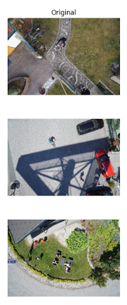
</figure>
</div>

<div align="center">(a)</div>

<div align="center">
<figure>
  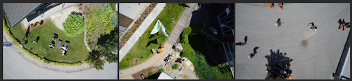
</figure>
</div>

<div align="center">(b)</div>

<div align="center">Figure 1: Example images from the Aerial Semantic Segmentation Drone Dataset</div>

The pictures provided in Figure 1 were used for testing the semantic segmentation algorithms. We chose these images for testing because it is difficult to distinguish between open areas and obstacles.

# Related Work

<u>Modern Research</u>

Our project focuses on semantic segmentation for robot navigation. In the past, several approaches have been explored in the area of semantic segmentation, ranging from traditional methods to deep learning-based techniques. Early fusion, late fusion, and hybrid fusion techniques have been looked into to combine modalities like RGB and depth data for improved segmentation accuracy [1].

Additionally, deep learning, particularly convolutional neural networks (CNNs), has also been used. Frameworks like Bonnet provide open-source tools specifically designed for semantic segmentation in robotics, streamlining model training and deployment processes [2]. This structure offers a thorough Python training process paired with a C++ deployment library, ensuring a smooth workflow for users creating and deploying semantic segmentation models. Bonnet enables users to customize datasets, set up neural networks, adjust hyperparameters, and train models efficiently for their specific robotic needs. By simplifying deployment on robotic platforms, Bonnet not only enhances research and development but also fosters collaboration within the robotics community, driving progress in semantic segmentation techniques and applications.

Other research reviews various deep neural network-based semantic segmentation methods, highlighting advancements, challenges, and future directions [5]. The authors discuss a range of methods, including region-based techniques such as RCNN and FCN-based methods, highlighting the significant advancements fueled by deep learning techniques in recent years. Despite these advancements, the paper acknowledges persistent challenges in areas such as generalization across diverse datasets, substantial data requirements for training, computational resource intensiveness, and effective error handling strategies. The researchers talk about the current efforts within the deep neural network community to address these challenges and further refine semantic segmentation methods for improved image understanding and analysis.

More robotics research has focused on vision-based navigation approaches using deep learning. Works like Lin et al.’s explore vision-based navigation schemes for wheeled robots, combining CNNs for semantic segmentation with fuzzy logic controllers for autonomous movement [4]. Other efforts have also been made to enhance robot autonomy through path planning algorithms like the rapidly-exploring random tree (RRT) search algorithm.

Finally, semantic segmentation has found applications beyond robotics, such as in agricultural robotics for crop analysis and monitoring. Magistri et al. propose an unsupervised domain adaptation approach for semantic segmentation in agricultural robotics, addressing challenges related to diverse environmental conditions [3]. This approach demonstrates impressive performance across a range of conditions, showcasing its potential to enhance the robustness and generalization capabilities of semantic segmentation models in agricultural robotics applications.

<u>Our Research In-Context</u>

Although prior work in the area of semantic segmentation in robotics covers many different aspects, research is still minimal for seamless integration of advanced segmentation algorithms with real-time performance requirements and adaptability to diverse environments. While existing techniques showed promise in accurately identifying and categorizing objects, they sometimes fell short in terms of computational efficiency, robustness across varied conditions, and scalability to different robotic platforms.

Our work aims to address these gaps by focusing on real-time performance, robustness and adaptability, and integration with path planning. Our project attempted to optimize semantic segmentation algorithms for real-time performance, ensuring that the processing speed meets the demands of dynamic robotic environments. It also involves exploring domain adaptation techniques to enhance the robustness of segmentation models across different environmental conditions. Finally, our work aims to integrate semantic segmentation with advanced path planning techniques such as the U-Net model.

# Method/Approach

<u>Method Overview</u>

Our current approach for semantic segmentation and robot navigation involves aerial semantic segmentation using the U-Net model with the Python package Keras. The U-Net model approach involved partitioning aerial or overhead images into meaningful segments and assigning semantic labels for each segment. The U-Net model is specifically designed for semantic segmentation tasks and is effective in scenarios like robot path planning where precise segmentation is crucial.

Here is some notation/terminology relevant to our project:
Semantic Segmentation: A computer vision task involving labeling each pixel in an image with a corresponding category or class label.
U-Net: A deep learning architecture commonly used for biomedical image segmentation, featuring an encoder-decoder structure with skip connections.
Segmentation Mask: A binary mask where each pixel is labeled as belonging to a specific class or background.
Intersection over Union (IoU): A metric used to evaluate the overlap between predicted and ground truth segmentation masks.
Pixel Accuracy: A metric measuring the proportion of correctly classified pixels in the segmentation output.
Runtime Assessment: Evaluating the efficiency and processing speed of algorithms or models.

<u>Project Components</u>

The first segment of our project involved aerial semantic segmentation, which refers to the process of partitioning aerial or overhead images into meaningful segments or regions and assigning semantic labels to each segment based on its content or characteristics. Commonly used in remote sensing, satellite imagery analysis, and drone-based applications to extract information from large-scale aerial images, we thought it could improve the robotic path planning process. We found one particular resource, which described performing semantic image segmentation using the U-Net model with Keras, an open-source deep learning framework written in Python [9]. The U-Net model is effective in handling semantic segmentation tasks, especially in scenarios like robot path planning, where precise segmentation is crucial. The overall pipeline consists of reading and organizing the data, initializing the U-Net model with appropriate parameters such as the number of classes and input dimensions, dividing the data into training and validation sets, training the model with early stopping for better convergence, saving the trained model for future use, making predictions using the trained model, and comparing the predictions with ground truth labels for evaluation.

Following aerial semantic segmentation, we implemented a path planning component. The algorithm uses predefined costs associated with segmented classes the images to find the cost with the lowest cost and shortest distance to the goal. A table of the costs corresponding to each class is provided in Table 1. Values of ‘0’ and ‘1’ were assigned to open areas and obstacles, respectively. We used the A* algorithm to determine the optimal path.

<table>
  <tr>
    <th>Cost</th>
    <th>Classes</th>
  </tr>
  <tr>
    <td>0</td>
    <td>paved-area, dirt, grass, gravel, rocks, vegetation, ar-marker</td>
  </tr>
  <tr>
    <td>1</td>
    <td>unlabeled, water, pool, roof, wall, window, door, fence, fence-pole, person, dog, car bicycle, tree, bald-tree, obstacle, conflicting</td>
  </tr>
</table> 
Table 1: Costs assigned to each class in the Aerial Semantic Segmentation Drone Dataset    


The final segment utilizes Harris Corner Detection and Scale-Invariant Feature Transform (SIFT) for corner detection in images and feature segmentation. This component was incorporated to investigate how these methods could extend the segmentation capability of U-Net to not only classify objects in a scene but also differentiate between individual objects of the same class. We used Harris Corner Detection to find points of interest in the scene images and the class pixel locations in the labeled images to locate interest points in a specified class such as ‘person.’ SIFT extracted features for each point from a surrounding 16 by 16 pixel window. To determine whether the same object could be identified in a different location, we mirrored the original image and found distances between feature vectors associated with interest points in each image. This models potential tracking of an object, a common application of drones.

<u>Contribution</u>

Our approach contributes to existing research by combining various deep learning techniques with path planning techniques for robot navigation. We were specifically targeting robot navigation, a critical aspect of robotics that requires precise scene understanding and obstacle detection for safe and efficient movement. By customizing semantic segmentation algorithms for this application sought to achieve better performance when compared to simpler segmentation models. Additionally, using U-Net for semantic segmentation brings advantages of both to our method. U-Net performs well at capturing context information and producing precise segmentation masks. Finally, the specific evaluation metrics we used (Intersection over Union (IoU), pixel accuracy, and runtime assessment) provide a comprehensive evaluation of the effectiveness and efficiency of our approach.

<u>Intuition</u>

We expect our approach to address some of the previous research’s limitations because we integrated an advanced segmentation architecture, incorporated path planning techniques, and customized for robot applications. First, many existing works focus on U-Net individually, without addressing its application to robot path planning. Our approach stands out by integrating these architectures for this purpose, which is a targeted and specialized application. We tailored the segmentation model to the unique requirements to robot autonomy, which can lead to more accurate and context-aware segmentation results.

Furthermore, while some references discuss vision-based navigation and deep learning methods for segmentation, there’s often a gap in integrating these components seamlessly. By combining segmentation with path planning, our approach attempts to provide robots with more informed and intelligent navigation capabilities, overcoming the limitations of disjointed perception and action components in existing literature.

Many related works also emphasize the importance of evaluation metrics like Intersection over Union (IoU) and pixel accuracy for assessing segmentation performance. Our approach aligns with this emphasis on rigorous evaluation by utilizing a range of metrics to measure segmentation accuracy, runtime efficiency, and overall performance.

# Experiment Setup

<u>Experiment purpose</u>

The purpose of our experiments was to evaluate the performance of the U-Net architectures for semantic segmentation in robot path planning, using VGG 16 as its base model. We trained the U-Net model on the Aerial Semantic Segmentation Drone Dataset [9] of urban scenes from a bird’s eye view, where each pixel is labeled into one of 24 classes relevant to robot navigation. U-Net model success was determined by how effectively the algorithm was able to categorize and identify obstacles for the robot. Moreover, the path planning and tracking segments were included to demonstrate the applications of semantic segmentation.

<u>Input description</u>

The dataset we used was the Aerial Semantic Segmentation Drone Dataset from Kaggle. The dataset consists of images of urban scenes from a bird’s eye view and each pixel is labeled to belong to 0 of 23 classes. The images measure 4000 pixels in height and 6000 pixels in width. The training set contains 320 images and the validation set contains 80 images.
  
A link to the dataset is given below:
Here is a link to the dataset:
https://www.kaggle.com/datasets/bulentsiyah/semantic-drone-dataset/data
http://dronedataset.icg.tugraz.at ← URL for citation

We used three main images from a bird’s eye view (from a drone). All three included some pavement, people, and some form of greenery. The dataset itself included various semantic classes, which were tree, grass, other vegetation, dirt, gravel, rocks, water, paved area, pool, person, dog, car, bicycle, roof, wall, fence, fence-pole, window, door, obstacle.

The segmentation model we decided to use was a U-Net with VGG 16 as its base model. We first resized each input image to be 416 pixels in height and 608 pixels in width because it is an acceptable input size for the model and each labeled image to be 208 pixels in height and 304 pixels in width with nearest neighbor interpolation since that is the size the model will output. We then trained the model for 5 epochs and saved it after it was done training. The runtime was 15543 seconds or 4 hours, 19 minutes, and 3 seconds. We then evaluated the segmentation performance using metrics such as pixel accuracy, mean IU, frequency weighted IU, and class wise IU with the results shown below. The images shown in Figure 1 were used for evaluation.

<u>Desired Output Description</u>

When we trained the model and put in the images, the expected output was images identifying obstacles that the robots cannot go through when trying to plan their paths. These images could be visually compared with the ground truth images, showing how effective they were. Examples are shown below in Figure 2.

<div align="center">
<figure>
  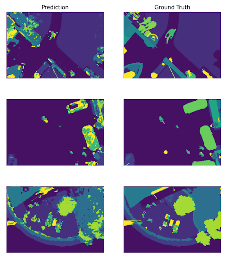
</figure>
</div>

<div align="center">
<figure>
  
</figure>
</div>
<div align="center">Figure 2: Example of U-Net model predictions and ground truth labels</div>

The output form is a pixel-wise segmentation mask where each pixel is assigned a class label representing different objects or regions relevant to robot navigation. The desired output includes pixel-wise segmentation masks and obstacle detection maps, providing detailed environmental understanding that is helpful for robots.

<u>Metric for Success</u>

We planned to measure our data with three metrics, Intersection over Union (IoU), runtime assessments, and pixel accuracy. IoU uses a ground-truth bounding box and a predicted bounding box, and is found by dividing the area of overlap by the area of union. Runtime assessment measures the efficiency of each method, but it is important to note that a faster algorithm is not necessarily always better. Finally, pixel accuracy is a semantic segmentation metric which measures the proportion of pixels that have been correctly identified by the model. By using these three metrics, we hope to capture a comprehensive overview of how effective each algorithm is.

# Results

<u>Semantic Segmentation</u>

The plots and images in Figures 3-5 demonstrate the usefulness of our method in robot navigation. U-Net converted images of an ambiguous environment into images of obstacles that the robot can identify for path planning and tracking. Figure 3 depicts how well the predictions aligned with the ground truths. The training and validation accuracies surpass 65%. Furthermore, the class-wise IoU values demonstrate that relatively small objects in a scene, such as cars, bicycles, dogs, and people, are more difficult to identify. A table of the values assigned to each class are provided in Appendix A Table 2.

<div align="center">
<figure>
  
</figure>
</div>

<div align="center">Figure 3: Evaluation of  U-Net Semantic Segmentation using pixel accuracy, mean IU, frequency weighted IU, and class wise IU</div>

<div align="center">
<figure>
  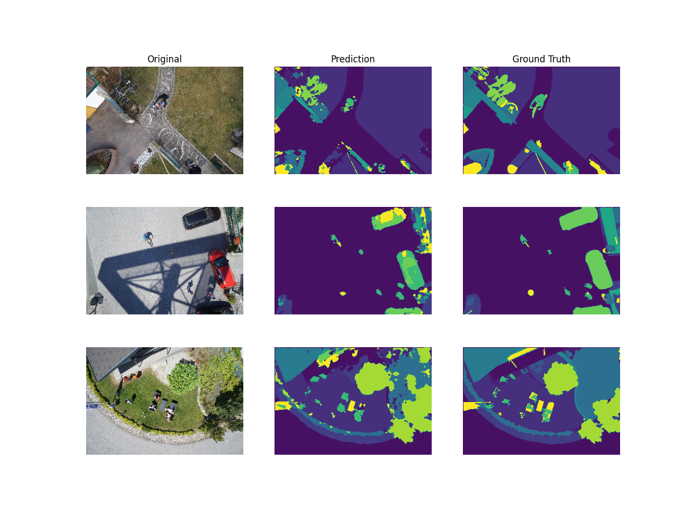
</figure>
</div>
 
<div align="center">Figure 4: Original aerial perspective images (left column), predicted segmented images by the U-Net model (middle column), and ground truth segmented images (right column)</div>

<div align="center">
<figure>
  
</figure>
</div>

<div align="center">
<figure>
  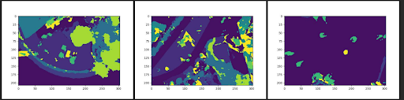
</figure>
</div>

<div align="center">Figure 5: U-Net model predictions (bottom row) compared to the ground truth (top row)</div>
 
The comparisons among original images, predictions, and ground truths show that the U-Net model can segment images, but it struggles to accurately classify entire objects, particularly small obstacles. 

<u>Path Planning</u>

Figure 6b displays the result of path planning using the A* method. The algorithm took a significantly long time to find a path, so the images were resized from 6000 by 4000 pixels to 94 by 63 pixels. The model was able to find an optimal path from start to end with minimal errors. The black regions of the image in Figure 6b are traversable, while the white regions must be avoided. The red line indicates the optimal path determined by the algorithm. 

<div align="center">
<figure>
  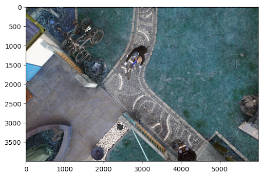=
</figure>
</div>

<div align="center">(a)</div>

<div align="center">
<figure>
  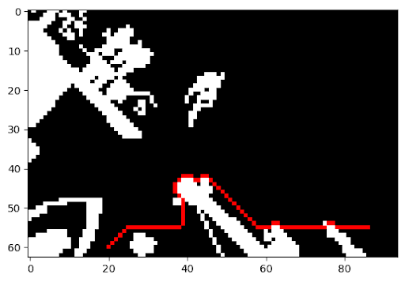
</figure>
</div>
 
<div align="center">(b)</div>

<div align="center">Figure 6: Original image (a) and predicted optimal path as red line through traversable (black) and non-traversable (white) regions of the scene (b); start: (60, 20), end: (55, 86)</div>

<div align="center">
<figure>
  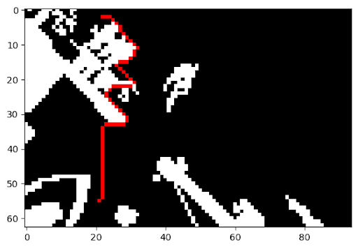
</figure>
</div>

<div align="center">Figure 7: predicted optimal path as red line through traversable (black) and non-traversable (white) regions of the scene; start: (55, 21), end: (2, 22)</div>
  
<u>Tracking</u>

For the tracking segment of the project, we mirrored the original image as shown in Figure 8a. The Harris Corner Detector found 1500 interest points with the highest confidences at the locations in Figure 8b, and interest points that did not belong to the ‘person’ class were removed in Figure 8c. Finally, the matches found using the SIFT method are provided in Figure 8d. Due to limited time, we were unable to go through every match to determine the accuracy of the correspondence. However, the visuals show that many of the points do accurately match to the corresponding person in the mirrored image.

<div align="center">
<figure>
  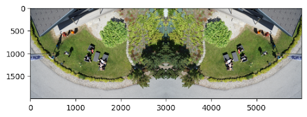
</figure>
</div>

<div align="center">(a)</div>

<div align="center">
<figure>
  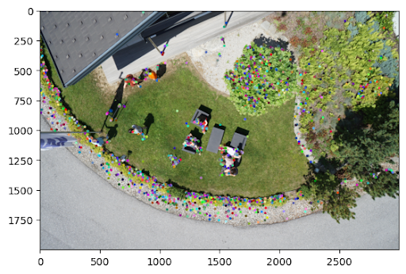
</figure>
</div>

<div align="center">(b)</div>

<div align="center">
<figure>
  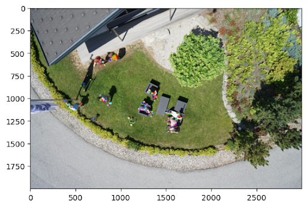
</figure>
</div>

<div align="center">(c)</div>

<div align="center">
<figure>
  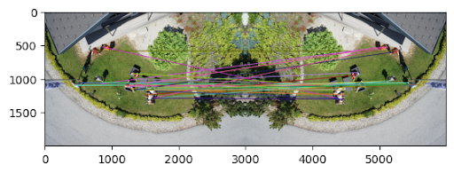
</figure>
</div>
  
<div align="center">(d)</div>

<div align="center">Figure 8: (a) original image, (b) 1500 interest points with highest confidences, (c) costs associated with ‘person’ class, (d) matches found between mirrored images</div>

<u>Considering Prior Research</u>

Due to limited prior works that integrate all three metrics for success (IoU, pixel accuracy, and runtime assessment), it is difficult to compare our results to prior work. According to one source, early deep learning approaches like CGG and AlexNet experienced overfitting and extensive training times, mostly because of inadequate discriminative deep features [1].  Later, FCNs worked well with the entire image for dense predictions. Initially, FCN architectures faced computational inefficiencies, which prompted the development of encoder-decoder architectures like U-Net. These both improved segmentation accuracy by capturing deep contextual information and enabling precise localization.

Another paper discusses Bonnet, an innovative open-source tool designed specifically for semantic segmentation in robotics [2]. One of the limitations of Bonnet lies in its dependency on well-defined steps for model training. While Bonnet offers sample architectures and pre-trained weights for various datasets and network sizes, it lacks comprehensive support for highly specialized network architectures. This is where our approach does well. Because it is specifically tailored for one set of images with certain classes for robot path planning, it is better able to distinguish obstacles in the scenes it is given.

# Discussion

Our project intended to implement and evaluate aerial semantic segmentation using the U-Net model. We were able to modify these algorithms and customize them for improving real-time classification and adaptability to diverse environments. U-Net was able to classify objects despite inaccuracies throughout all predictions. Our project contributed to existing research by integrating deep learning techniques with path planning strategies, giving us promising results in obstacle detection and scene understanding for robots.

Through this project, we learned about the complexities involved in training and optimizing deep learning models for real-world applications. We also got to look into the role of evaluation metrics like IoU, pixel accuracy, and runtime assessment in quantifying model performance accurately.

From our project, there are many different areas for future research. First of all, experimenting with different architectures, data augmentation techniques, and real-time performance optimizations could enhance model robustness and generalization. Additionally, exploring domain adaptation strategies to improve model adaptability across diverse environmental conditions is another direction for future research. Incorporating other algorithms like Rapidly-exploring Random Tree (RRT) algorithms and A* could lead to even more sophisticated and reliable robot navigation systems.

# Challenges Encountered

Our team faces challenges related to the U-Net model outputs needing improvement and insufficient RAM space. We got errors during model loading and training due to memory limitations. One of the main challenges we faced was the need to enhance the output generated by the U-Net model. This meant improving the accuracy of semantic segmentation, refining the boundaries between object classes, and improving the quality of segmentation masks.

Another challenge we faced was the limited RAM space, which led to errors during model loading and training. The exact errors we were getting dealt with issues related to loading weights and memory allocation during runtime. With only 8 GB of RAM, training complex deep learning models like U-Net is computationally intense, especially for large datasets, high-resolution images, or intricate architectures. We needed at least 16 GB or RAM to be able to accurately train and run our methods.

In the future, we would optimize the U-Net model architecture further to reduce memory usage while maintaining or improving performance. This could mean looking into techniques like model pruning, quantization, or using lighter-weight variants of the U-Net architecture that are made specifically for constrained environments. In addition, using cloud-based computing resources or high-performance computing clusters like the GTRI PACE clusters could help mitigate RAM constraints and help smoothen the model training and evaluation process. Additionally, we would like to extend this project to other deep learning network architectures to compare their performance to U-Net with more computational power. 

For path planning, the predicted paths tended to follow obstacles very closely, so programming a conservative boundary around obstacles would improve obstacle avoidance and social awareness by giving people walking around more space. Additionally, it took several seconds for the algorithm to output a path, which would not be acceptable in real-time navigation through dynamic scenes.

Furthermore, the tracking component of the project yielded matches, but we were unable to provide metrics for the degree of accuracy of the method. In addition, the code took several minutes to generate feature vectors for the interest points. Despite that lack of concrete measurements and slow speed, we sought to demonstrate the application of the Harris Corner Detector and SIFT for fine-tuning the U-Net model. 

# Team Member Contributions

Nandini: compiled results and wrote a substantial amount of the report

Erika: wrote the path planning and tracking code and report sections in addition to report revisions

Bruce: adapted U-Net model to the project generated output and revised report

# References

[1] J. V. Hurtado and A. Valada, “Semantic Scene Segmentation for Robotics,” Deep Learning for Robot Perception and Cognition, pp. 279–311, 2022. doi:10.1016/b978-0-32-385787-1.00017-8

[2] A. Milioto and C. Stachniss, “Bonnet: An Open-source Training and Deployment Framework for Semantic Segmentation in Robotics using CNNs,” 2019 International Conference on Robotics and Automation (ICRA), May 2019. doi:10.1109/icra.2019.8793510

[3] F. Magistri et al., “From one field to another—unsupervised domain adaptation for semantic segmentation in Agricultural Robotics,” Computers and Electronics in Agriculture, vol. 212, p. 108114, Sep. 2023. doi:10.1016/j.compag.2023.108114

[4] J. Lin, W.-J. Wang, S.-K. Huang, and H.-C. Chen, “Learning based Semantic Segmentation for Robot Navigation in Outdoor Environment,” IEEE.org, https://ieeexplore.ieee.org/abstract/document/8023347/ (accessed Feb. 22, 2024).

[5] Y. Guo, Y. Liu, T. Georgiou, and M. S. Lew, “A review of semantic segmentation using Deep Neural Networks - International Journal of Multimedia Information Retrieval,” SpringerLink, https://link.springer.com/article/10.1007/s13735-017-0141-z (accessed Feb. 21, 2024).

[6] Y. Mo, Y. Wu, X. Yang, F. Liu, and Y. Liao, “Review the State-of-the-art Technologies of Semantic Segmentation Based on Deep Learning,” Neurocomputing, vol. 493, pp. 626–646, Jul. 2022. doi:10.1016/j.neucom.2022.01.005

[7] Fujiya, G. (2023, May 25). Aerial Semantic Segmentation (U-Net, keras). Kaggle. https://www.kaggle.com/code/gokifujiya/aerial-semantic-segmentation-u-net-keras/notebook

[8] Ben-Cohen, A., & Greenspan, H. (2019). Convolutional Network. Convolutional Network - an Overview | ScienceDirect Topics. https://www.sciencedirect.com/topics/computer-science/convolutional-network#:~:text=A%20fully%20convolutional%20network%20(FCN,size%20as%20the%20input%20image%20%5B

[9] Fujiya, G. (2023, May 25). Aerial Semantic Segmentation (U-Net, keras). Kaggle. https://www.kaggle.com/code/gokifujiya/aerial-semantic-segmentation-u-net-keras/notebook

[10] Ben-Cohen, A., & Greenspan, H. (2019). Convolutional Network. Convolutional Network - an Overview | ScienceDirect Topics. https://www.sciencedirect.com/topics/computer-science/convolutional-network#:~:text=A%20fully%20convolutional%20network%20(FCN,size%20as%20the%20input%20image%20%5B

# Appendix
<u>A</u>
<table>
  <tr>
    <th>Class</th>
    <th>Index</th>
  </tr>
  <tr>
    <td>unlabeled</td>
    <td>0</td>
  </tr>
  <tr>
    <td>paved-area</td>
    <td>1</td>
  </tr>
  <tr>
    <td>dirt</td>
    <td>2</td>
  </tr>
  <tr>
    <td>grass</td>
    <td>3</td>
  </tr>
  <tr>
    <td>gravel</td>
    <td>4</td>
  </tr>
  <tr>
    <td>water</td>
    <td>5</td>
  </tr>
  <tr>
    <td>rocks</td>
    <td>6</td>
  </tr>
  <tr>
    <td>pool</td>
    <td>7</td>
  </tr>
  <tr>
    <td>vegetation</td>
    <td>8</td>
  </tr>
  <tr>
    <td>roof</td>
    <td>9</td>
  </tr>
  <tr>
    <td>wall</td>
    <td>10</td>
  </tr>
  <tr>
    <td>window</td>
    <td>11</td>
  </tr>
  <tr>
    <td>door</td>
    <td>12</td>
  </tr>
  <tr>
    <td>fence</td>
    <td>13</td>
  </tr>
  <tr>
    <td>fence-pole</td>
    <td>14</td>
  </tr>
  <tr>
    <td>person</td>
    <td>15</td>
  </tr>
  <tr>
    <td>dog</td>
    <td>16</td>
  </tr>
  <tr>
    <td>car</td>
    <td>17</td>
  </tr>
  <tr>
    <td>bicycle</td>
    <td>18</td>
  </tr>
  <tr>
    <td>tree</td>
    <td>19</td>
  </tr>
  <tr>
    <td>bald-tree</td>
    <td>20</td>
  </tr>
  <tr>
    <td>ar-marker</td>
    <td>21</td>
  </tr>
  <tr>
    <td>obstacle</td>
    <td>22</td>
  </tr>
  <tr>
    <td>conflicting</td>
    <td>23</td>
  </tr>
</table> 
Table 2: Indices of the 24 segmented class

<!--
Text can be **bold**, _italic_, or ~~strikethrough~~.

[Link to another page](./another-page.html).

There should be whitespace between paragraphs.

There should be whitespace between paragraphs. We recommend including a README, or a file with information about your project.

# Header 1

This is a normal paragraph following a header. GitHub is a code hosting platform for version control and collaboration. It lets you and others work together on projects from anywhere.

## Header 2

> This is a blockquote following a header.
>
> When something is important enough, you do it even if the odds are not in your favor.

### Header 3

```js
// Javascript code with syntax highlighting.
var fun = function lang(l) {
  dateformat.i18n = require('./lang/' + l)
  return true;
}
```

```ruby
# Ruby code with syntax highlighting
GitHubPages::Dependencies.gems.each do |gem, version|
  s.add_dependency(gem, "= #{version}")
end
```

#### Header 4

*   This is an unordered list following a header.
*   This is an unordered list following a header.
*   This is an unordered list following a header.

##### Header 5

1.  This is an ordered list following a header.
2.  This is an ordered list following a header.
3.  This is an ordered list following a header.

###### Header 6

| head1        | head two          | three |
|:-------------|:------------------|:------|
| ok           | good swedish fish | nice  |
| out of stock | good and plenty   | nice  |
| ok           | good `oreos`      | hmm   |
| ok           | good `zoute` drop | yumm  |

### There's a horizontal rule below this.

* * *

### Here is an unordered list:

*   Item foo
*   Item bar
*   Item baz
*   Item zip

### And an ordered list:

1.  Item one
1.  Item two
1.  Item three
1.  Item four

### And a nested list:

- level 1 item
  - level 2 item
  - level 2 item
    - level 3 item
    - level 3 item
- level 1 item
  - level 2 item
  - level 2 item
  - level 2 item
- level 1 item
  - level 2 item
  - level 2 item
- level 1 item

### Small image


### Large image


### Definition lists can be used with HTML syntax.

<dl>
<dt>Name</dt>
<dd>Godzilla</dd>
<dt>Born</dt>
<dd>1952</dd>
<dt>Birthplace</dt>
<dd>Japan</dd>
<dt>Color</dt>
<dd>Green</dd>
</dl>

```
Long, single-line code blocks should not wrap. They should horizontally scroll if they are too long. This line should be long enough to demonstrate this.
```

```
The final element.
```
-->

